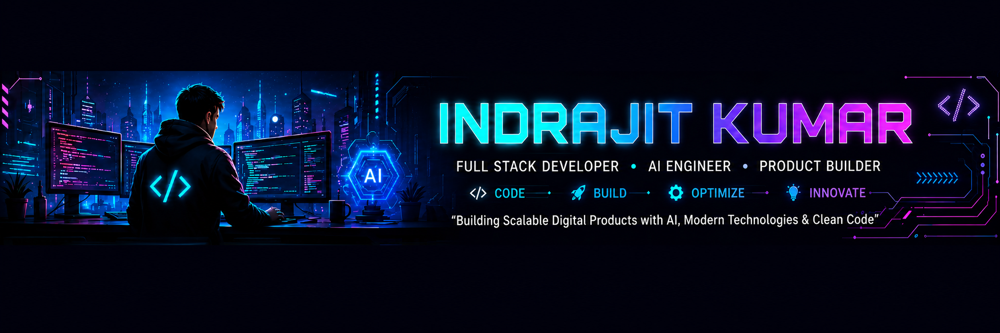
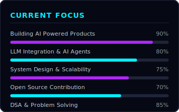
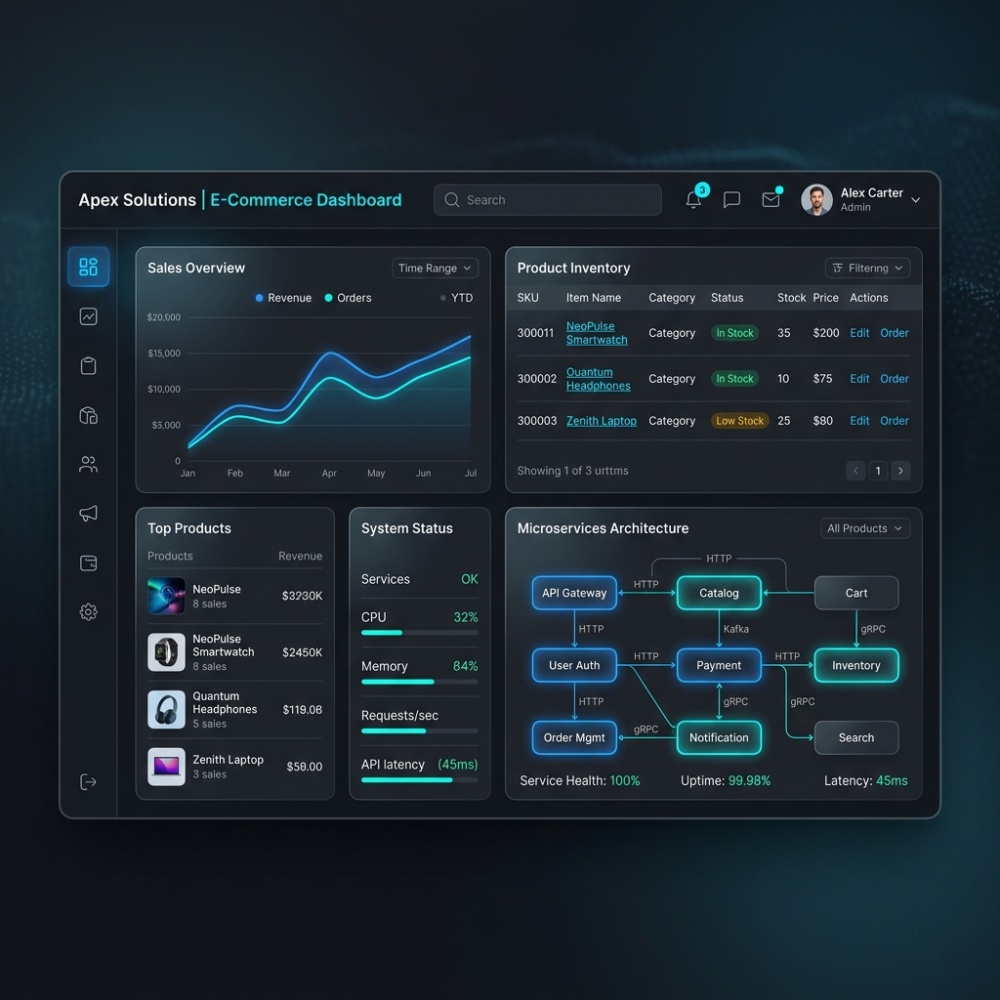
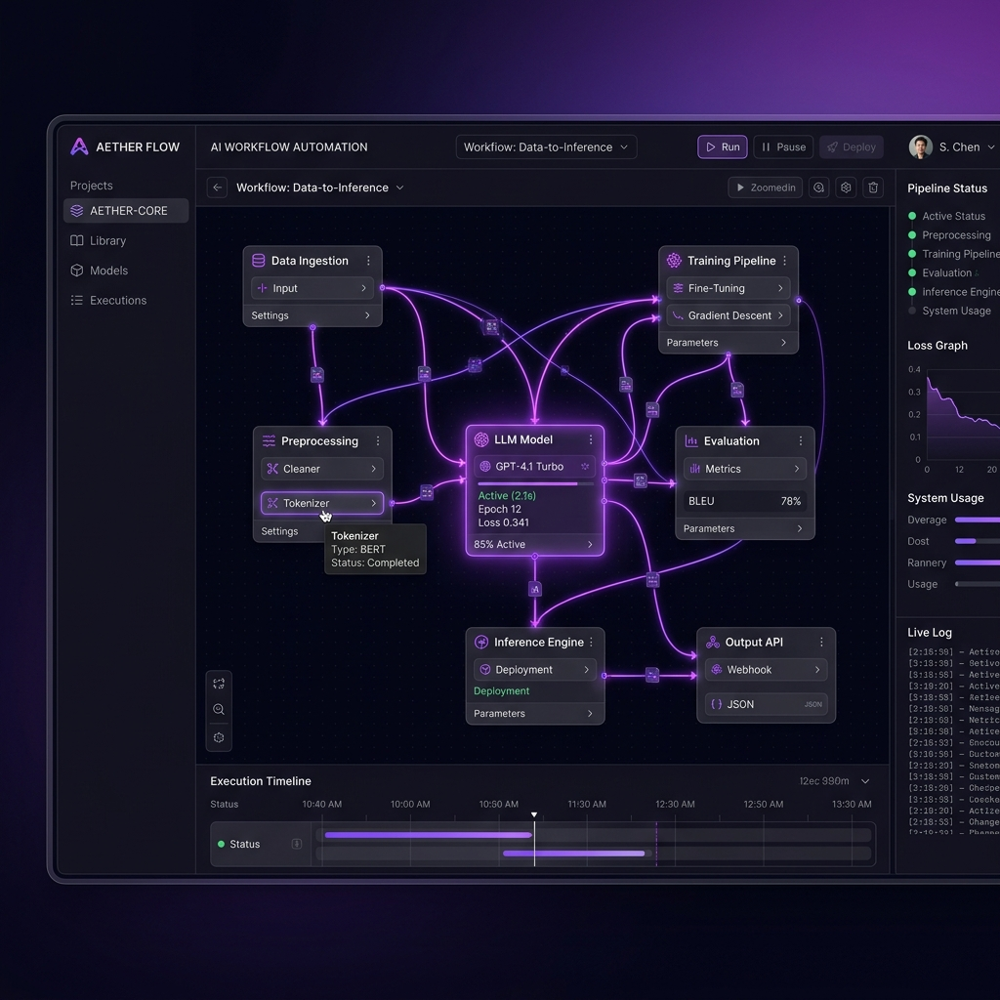
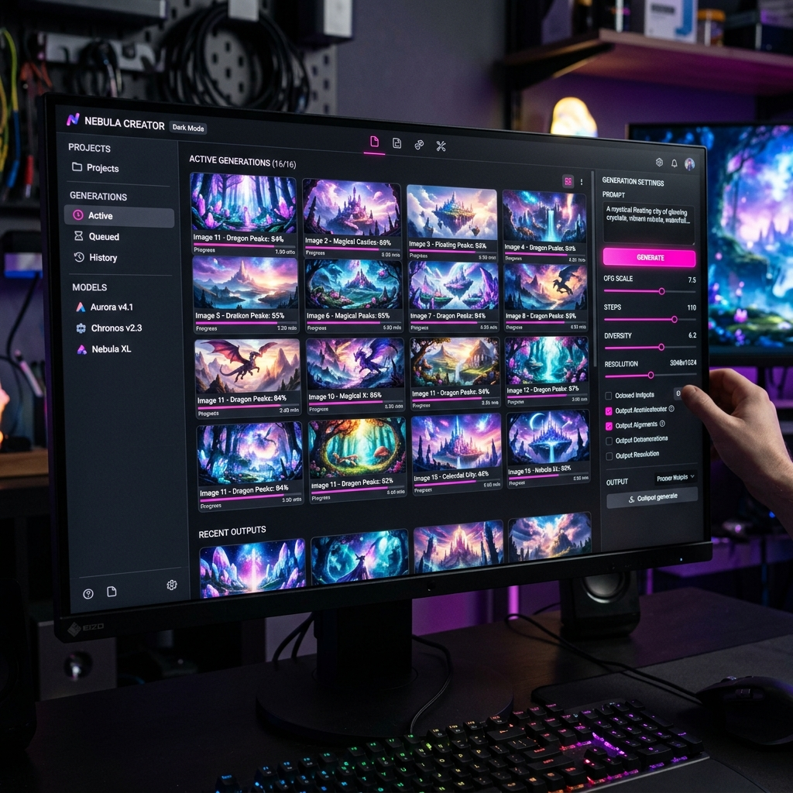

  
  
   
   

  <!-- Glowing Social Badges -->
  
  
  
  
  
  

 

  

 

<table width="100%" style="border-collapse: collapse; border: none; background-color: #060913;">
  <tr style="border: none;">
    <!-- ============================================== -->
    <!-- LEFT COLUMN: ABOUT, FOCUS & EDUCATION          -->
    <!-- ============================================== -->
    <td width="30%" valign="top" style="border: 1px solid #1f2438; padding: 20px; border-radius: 12px; background: #0a0e1c;">
      <h3 align="center" style="color: #00f0ff; font-family: monospace;">&gt; ABOUT ME</h3>
      

        Passionate Software Engineer specializing in scalable Full Stack applications, Artificial Intelligence, System Design, Cloud Technologies, and Product Development.  
        I enjoy transforming innovative ideas into intelligent digital products using modern technologies.
      

       
      

        
      

       
      <h3 align="center" style="color: #b026ff; font-family: monospace;">&gt; EDUCATION</h3>
      

        <b>B.Tech Computer Science Engineering</b> 
        Jagannath University Jaipur 
        Expected Graduation: July 2027
      

       
      <h3 align="center" style="color: #00f0ff; font-family: monospace;">&gt; CERTIFICATIONS</h3>
      

        🏅 <b>PCAP: Programming Essentials in Python</b> 
        Jul 2024  
        🛡️ <b>Introduction to Cybersecurity</b> 
        Jun 2025  
        📜 <b>SWOC 2026 - Certificate of Appreciation</b> 
        Feb 2026
      

       
      <h3 align="center" style="color: #ff4785; font-family: monospace;">&gt; SYS.LOCATION</h3>
      

        📍 Bihar, India
      

    </td>
    <!-- ============================================== -->
    <!-- CENTER COLUMN: FEATURED PROJECTS               -->
    <!-- ============================================== -->
    <td width="40%" valign="top" align="center" style="border: 1px solid #1f2438; padding: 20px; border-radius: 12px; background: #0a0e1c;">
      <h3 style="color: #ffffff; font-family: monospace;">&gt; DEPLOYED_ASSETS</h3>
       
      

        <h4 style="color: #00f0ff; margin: 0 0 5px 0;">KLYRO</h4>
        
AI-Powered Hybrid E-Commerce Platform

        
      

       
      

        <h4 style="color: #b026ff; margin: 0 0 5px 0;">Indra AI</h4>
        
AI Workflow Automation Platform

        
      

       
      

        <h4 style="color: #ff4785; margin: 0 0 5px 0;">Promptly AI</h4>
        
AI Image Generation Studio

        
      

    </td>
    <!-- ============================================== -->
    <!-- RIGHT COLUMN: TECH STACK & STATS               -->
    <!-- ============================================== -->
    <td width="30%" valign="top" style="border: 1px solid #1f2438; padding: 20px; border-radius: 12px; background: #0a0e1c;">
      <h3 align="center" style="color: #00f0ff; font-family: monospace;">&gt; TECH_CORE</h3>
      

        <!-- Languages -->
        
<b>LANGUAGES</b>

        
        
        
        
        
        
         
        <!-- Frontend -->
        
<b>FRONTEND</b>

        
        
        
        
        
        
         
        <!-- Backend & Cloud -->
        
<b>BACKEND & CLOUD</b>

        
        
        
        
        
        
        
        
        
        
        
        
        
        
         
        <!-- Databases -->
        
<b>DATABASES</b>

        
        
        
        
         
        <!-- AI/ML -->
        
<b>AI & ML</b>

        
        
        
        
        
        
        
        
        
        
        
        
        
         
        <!-- Tools -->
        
<b>DEVOPS & TOOLS</b>

        
        
        
        
        
        
        
        
        
        
      

       
      <h3 align="center" style="color: #b026ff; font-family: monospace;">&gt; GITHUB_TELEMETRY</h3>
      

        
         
        
      

    </td>
  </tr>
</table>

 

  

 

<!-- ============================================== -->
<!-- BOTTOM SECTION: GRAPH & LEETCODE & TROPHIES    -->
<!-- ============================================== -->

  <h3 style="color: #00f0ff; font-family: monospace;">&gt; CODE_FREQUENCY_ANALYSIS</h3>
  <!-- GitHub Activity Graph -->
  

    
  
  <h3 style="color: #ff4785; font-family: monospace;">&gt; LEETCODE_METRICS</h3>
  <!-- LeetCode Stats -->
  
  
    

  <h3 style="color: #b026ff; font-family: monospace;">&gt; SYSTEM_ACHIEVEMENTS</h3>
  
  
    

  <h3 style="color: #00f0ff; font-family: monospace;">&gt; NETWORK_CONTRIBUTIONS</h3>
  <!-- Snake Animation Placeholder (Generated via Action) -->
  <picture>
    <source media="(prefers-color-scheme: dark)" srcset="https://raw.githubusercontent.com/indrajitkumar23541-a11y/indrajitkumar23541-a11y/output/github-contribution-grid-snake-dark.svg">
    <source media="(prefers-color-scheme: light)" srcset="https://raw.githubusercontent.com/indrajitkumar23541-a11y/indrajitkumar23541-a11y/output/github-contribution-grid-snake.svg">
    
  </picture>

    

  <h3 style="color: #ffffff; font-family: monospace;">&gt; DAILY_INSPIRATION</h3>
  

    

  <!-- Profile Views Counter -->
  

    
  

