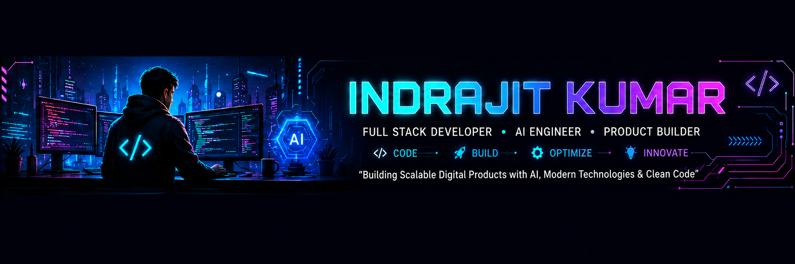

  

<!-- Glowing Social Badges -->

 

 

<!-- ============================================== -->
<!-- SECTION 1: ABOUT ME & PHILOSOPHY               -->
<!-- ============================================== -->
<table width="100%" style="border-collapse: collapse; border: 1px solid #1a233a;">
<tr>
<th colspan="2" align="left" style="background-color: #0a0e1c; color: #00f0ff; font-family: monospace; font-size: 16px; padding: 14px 18px; border: 1px solid #1a233a;">
👤 About Me
</th>
</tr>
<tr style="background-color: #0a0e1c;">
<td width="60%" valign="top" style="padding: 18px; border: 1px solid #1a233a;">

Passionate <b>Software Engineer</b> specializing in scalable Full Stack applications, Artificial Intelligence, System Design, Cloud Technologies, and Product Development.

I enjoy transforming innovative ideas into intelligent digital products using modern technologies. I'm always eager to learn, build, and contribute to meaningful products that make a real impact.

</td>
<td width="40%" valign="middle" align="center" style="padding: 18px; border: 1px solid #1a233a; background-color: #0d1224;">

❝

Technology is not just about code, it's about creating opportunities, solving real problems and making life better for people.

— <b style="color: #00f0ff;">Indrajit Kumar</b>

</td>
</tr>
</table>

 

 

<!-- ============================================== -->
<!-- SECTION 2: TECH STACK                          -->
<!-- ============================================== -->
<table width="100%" style="border-collapse: collapse; border: 1px solid #1a233a;">
<tr>
<th colspan="3" align="left" style="background-color: #0a0e1c; color: #00f0ff; font-family: monospace; font-size: 16px; padding: 14px 18px; border: 1px solid #1a233a;">
💠 Tech Stack
</th>
</tr>
<tr style="background-color: #0a0e1c;">
<td width="33.33%" valign="top" style="padding: 16px; border: 1px solid #1a233a;">

⚡ Languages

</td>
<td width="33.33%" valign="top" style="padding: 16px; border: 1px solid #1a233a;">

🎨 Frontend

</td>
<td width="33.33%" valign="top" style="padding: 16px; border: 1px solid #1a233a;">

⚙️ Backend & APIs

</td>
</tr>
<tr style="background-color: #0a0e1c;">
<td width="33.33%" valign="top" style="padding: 16px; border: 1px solid #1a233a;">

🗄️ Databases & Storage

</td>
<td width="33.33%" valign="top" style="padding: 16px; border: 1px solid #1a233a;">

🤖 AI & Machine Learning

</td>
<td width="33.33%" valign="top" style="padding: 16px; border: 1px solid #1a233a;">

☁️ DevOps, Cloud & Tools

</td>
</tr>
</table>

 

 

<!-- ============================================== -->
<!-- SECTION 3: FEATURED PROJECTS                   -->
<!-- ============================================== -->
<table width="100%" style="border-collapse: collapse; border: 1px solid #1a233a;">
<tr>
<th colspan="3" align="left" style="background-color: #0a0e1c; color: #00f0ff; font-family: monospace; font-size: 16px; padding: 14px 18px; border: 1px solid #1a233a;">
🚀 Featured Projects
</th>
</tr>
<tr style="background-color: #0a0e1c;">
<td width="33.33%" valign="top" style="padding: 16px; border: 1px solid #1a233a;">
<b style="color: #ffffff; font-size: 15px;">🛒 KLYRO</b> 
E-Commerce Platform

The ultimate full-stack premium ecommerce platform. Cinematic design, multi-category hubs, AI concierge, and React architecture.

</td>
<td width="33.33%" valign="top" style="padding: 16px; border: 1px solid #1a233a;">
<b style="color: #ffffff; font-size: 15px;">🏥 PraGo</b> 
AI Medical Platform

All-in-one medical ecosystem featuring AI chat consultation, video appointments, medicine delivery, and hospital finder.

</td>
<td width="33.33%" valign="top" style="padding: 16px; border: 1px solid #1a233a;">
<b style="color: #ffffff; font-size: 15px;">📈 Indra-MarketMind</b> 
Stock Sentiment Tracker

Real-time financial intelligence platform correlating live news sentiment with stock price volatility to emit market trend signals.

</td>
</tr>
<tr style="background-color: #0a0e1c;">
<td width="33.33%" valign="top" style="padding: 16px; border: 1px solid #1a233a;">
<b style="color: #ffffff; font-size: 15px;">🧠 Indra AI</b> 
AI Workflow Automation

Personal agentic AI assistant & open-source API layer providing RAG, web search, PDF intelligent document analysis, and LLM workflows.

</td>
<td width="33.33%" valign="top" style="padding: 16px; border: 1px solid #1a233a;">
<b style="color: #ffffff; font-size: 15px;">🎨 Promptly AI</b> 
AI Image Studio

Advanced web interface for generating AI images, text-to-image synthesis, image upscaling, and creative model pipelines.

</td>
<td width="33.33%" valign="top" style="padding: 16px; border: 1px solid #1a233a;">
<b style="color: #ffffff; font-size: 15px;">📻 Yaadon Ki Duniya</b> 
Nostalgic Experience

Immersive web journey reviving vintage Indian nostalgia through curated retro music, ambient soundscapes, and visuals.

</td>
</tr>
</table>

 

 

<!-- ============================================== -->
<!-- SECTION 4: MORE REPOSITORIES & CORE CODE       -->
<!-- ============================================== -->
<table width="100%" style="border-collapse: collapse; border: 1px solid #1a233a;">
<tr>
<th colspan="3" align="left" style="background-color: #0a0e1c; color: #b026ff; font-family: monospace; font-size: 16px; padding: 14px 18px; border: 1px solid #1a233a;">
📦 Additional Repositories & Engineering Practice
</th>
</tr>
<tr style="background-color: #0a0e1c;">
<td width="33.33%" valign="top" style="padding: 16px; border: 1px solid #1a233a;">
<a href="https://github.com/indrajitkumar23541-a11y/Disease-prediction" style="text-decoration: none;">
<b style="color: #00f0ff; font-size: 14px;">🏥 Disease-prediction</b>
</a>

Bayes' Theorem probability calculator estimating disease survival rates from medical data.

</td>
<td width="33.33%" valign="top" style="padding: 16px; border: 1px solid #1a233a;">
<a href="https://github.com/indrajitkumar23541-a11y/mahalaxmi-hostel" style="text-decoration: none;">
<b style="color: #3ecf8e; font-size: 14px;">🏢 mahalaxmi-hostel</b>
</a>

Full-featured Hostel Management web application built with Django, role handling, and resident records.

</td>
<td width="33.33%" valign="top" style="padding: 16px; border: 1px solid #1a233a;">
<a href="https://github.com/indrajitkumar23541-a11y/deepak-governance" style="text-decoration: none;">
<b style="color: #ffaa00; font-size: 14px;">🏛️ deepak-governance</b>
</a>

Modern public governance information and civic services tracking interface.

</td>
</tr>
<tr style="background-color: #0a0e1c;">
<td width="33.33%" valign="top" style="padding: 16px; border: 1px solid #1a233a;">
<a href="https://github.com/indrajitkumar23541-a11y/DSA-In-C-" style="text-decoration: none;">
<b style="color: #00f0ff; font-size: 14px;">⚡ DSA-In-C-</b>
</a>

Optimized solutions, core data structures, and algorithmic problems implemented in modern C++.

</td>
<td width="33.33%" valign="top" style="padding: 16px; border: 1px solid #1a233a;">
<a href="https://github.com/indrajitkumar23541-a11y/JAVA-DSA" style="text-decoration: none;">
<b style="color: #b026ff; font-size: 14px;">☕ JAVA-DSA</b>
</a>

Complete Java Data Structures & Algorithms practice code, trees, dynamic programming, and graphs.

</td>
<td width="33.33%" valign="top" style="padding: 16px; border: 1px solid #1a233a;">
<a href="https://github.com/indrajitkumar23541-a11y/PYTHON" style="text-decoration: none;">
<b style="color: #ff4785; font-size: 14px;">🐍 PYTHON</b>
</a>

Python programming concepts, automation scripting modules, and foundational learning codebase.

</td>
</tr>
</table>

 

 

<!-- ============================================== -->
<!-- SECTION 5: GITHUB TELEMETRY                    -->
<!-- ============================================== -->
<table width="100%" style="border-collapse: collapse; border: 1px solid #1a233a;">
<tr>
<th align="left" style="background-color: #0a0e1c; color: #00f0ff; font-family: monospace; font-size: 16px; padding: 14px 18px; border: 1px solid #1a233a;">
📊 GitHub Telemetry
</th>
</tr>
<tr style="background-color: #0a0e1c;">
<td align="center" style="padding: 18px 10px; border: 1px solid #1a233a;">

</td>
</tr>
</table>

 

 

<!-- ============================================== -->
<!-- SECTION 6: ACHIEVEMENTS & METRICS              -->
<!-- ============================================== -->
<table width="100%" style="border-collapse: collapse; border: 1px solid #1a233a;">
<tr>
<th colspan="4" align="left" style="background-color: #0a0e1c; color: #b026ff; font-family: monospace; font-size: 16px; padding: 14px 18px; border: 1px solid #1a233a;">
🏆 Achievements & Coding Metrics
</th>
</tr>
<tr style="background-color: #0a0e1c;">
<td width="25%" align="center" style="padding: 16px 8px; border: 1px solid #1a233a; background-color: #0d1224;">
⚡ 
<b style="color: #ffaa00; font-size: 16px;">383+</b> 
LeetCode Problems
</td>
<td width="25%" align="center" style="padding: 16px 8px; border: 1px solid #1a233a; background-color: #0d1224;">
📜 
<b style="color: #b026ff; font-size: 15px;">SWOC 2026</b> 
Contributor
</td>
<td width="25%" align="center" style="padding: 16px 8px; border: 1px solid #1a233a; background-color: #0d1224;">
🌐 
<b style="color: #3ecf8e; font-size: 15px;">Open Source</b> 
Active Contributor
</td>
<td width="25%" align="center" style="padding: 16px 8px; border: 1px solid #1a233a; background-color: #0d1224;">
🚀 
<b style="color: #00f0ff; font-size: 15px;">Product Builder</b> 
Building The Future
</td>
</tr>
<tr style="background-color: #0a0e1c;">
<td colspan="2" width="50%" align="center" style="padding: 16px 8px; border: 1px solid #1a233a; vertical-align: middle;">

</td>
<td colspan="2" width="50%" align="center" style="padding: 16px 8px; border: 1px solid #1a233a; vertical-align: middle;">

</td>
</tr>
</table>

 

 

<!-- ============================================== -->
<!-- FOOTER                                         -->
<!-- ============================================== -->

Let's Build Something Amazing Together 🚀

<!-- Profile Views Counter -->

